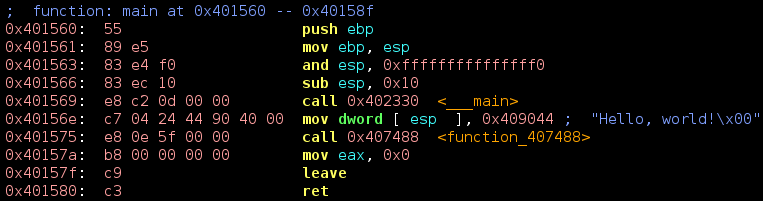

RetDec Disassembly Syntax For Vim
=================================

A Vim syntax-highlighting file for the output from the
[RetDec](https://retdec.com/)'s disassembler.



[RetDec](https://retdec.com/) is an open-source machine-code decompiler. One of
its outputs is a disassembled version of the input binary file. This Vim plugin
adds syntax highlighting when viewing these disassemblies.

Installation
============

If you use [pathogen](https://github.com/tpope/vim-pathogen), simply go into
the `bundle` directory and clone the repository in there:
```
cd ~/.vim/bundle
git clone https://github.com/s3rvac/vim-syntax-retdecdsm.git
```
You can also install the plugin manually by copying the
[`syntax/retdecdsm.vim`](https://raw.githubusercontent.com/s3rvac/vim-syntax-retdecdsm/master/syntax/retdecdsm.vim)
file to your `~/.vim/syntax` directory. If that directory does not exist,
create it.

Usage
=====

When you open a [RetDec](https://retdec.com/)'s disassembly in Vim, execute
`:set ft=retdecdsm` to enable syntax highlighting. Alternatively, you can put
the following autocommand to your `.vimrc`:
```
" Consider *.dsm files as files containing disassembly from RetDec.
autocmd BufNewFile,BufRead *.dsm set filetype=retdecdsm
```

License
-------

Copyright (c) 2016 Petr Zemek (s3rvac@petrzemek.net) and contributors.

Distributed under the MIT license. See the
[`LICENSE`](https://github.com/s3rvac/vim-syntax-retdecdsm/blob/master/LICENSE)
file for more details.
